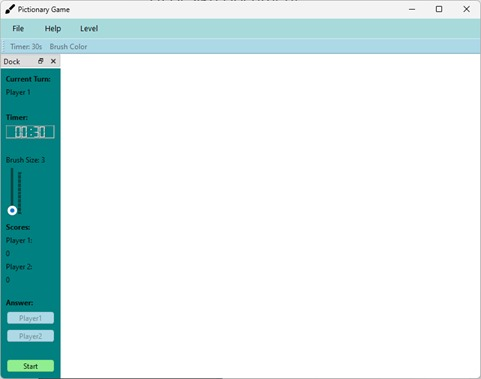
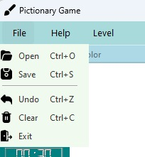
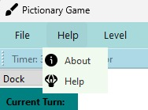
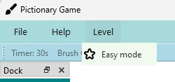
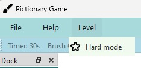
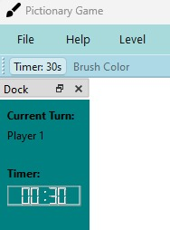
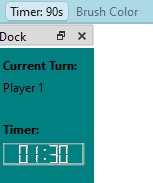
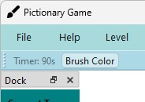
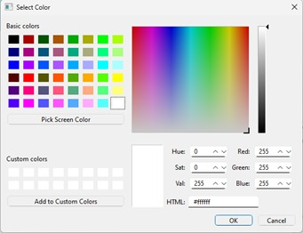
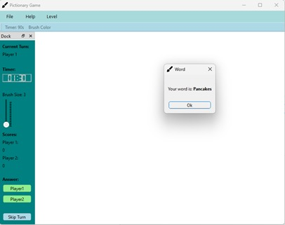

# Pictionary Game 🎨

A simple and user-friendly **Pictionary Game** built using **Python (PyQt6)**. Designed with a clean and intuitive UI, this project focuses on enhancing the user experience through responsive design, customizable drawing tools, and smooth gameplay.

---

## 🚀 Overview

This Pictionary game is designed for **two players**. One player draws the given word, and the other guesses it. The game includes:

* Custom brush colors
* Adjustable brush size
* Timer functionality
* File open & save features
* Undo & Clear actions
* Easy/Hard difficulty modes
* Score tracking

The UI is simple enough that players can understand it instantly without reading instructions.

---

## 🖼️ Screenshots

Below are the updated UI screenshots:

### 📌 Main Interface

### 📁 File Menu

### ❓ Help Menu

### 🎮 Level Menu

### ⏱️ Timer Toolbar

### 🎨 Brush Color Selector

### ▶️ Start Game Window

## 🔧 Component Design

### 🪟 Window & General UI

* Centered main window
* Menu bar on top, toolbar below
* Left dock for controls
* Soft, friendly color palette

### ☰ Menu Bar & Toolbar

* Light blue/yellow for visibility
* Clean icons
* Hover effects for feedback

### ✏️ Drawing Area & Tools

* Scalable white canvas
* Smooth round brush
* Slider for brush size (1–30)
* Color picker for brush colors

### 👥 Player Info & Controls

* Dark cyan dock
* Light blue & green action buttons
* Clear labels and easy-to-click buttons

---

## ⭐ Additional Features

* Timer
* Brush size slider
* Color palette
* Undo action

---

## 🏫 College Information

**Griffith College Dublin**
**HCI & GUI Programming – Assignment 02**
**2024**

---

Feel free to fork, open issues, or submit pull requests! 😊
